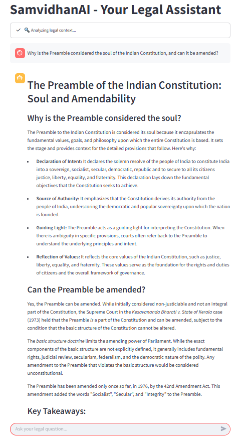
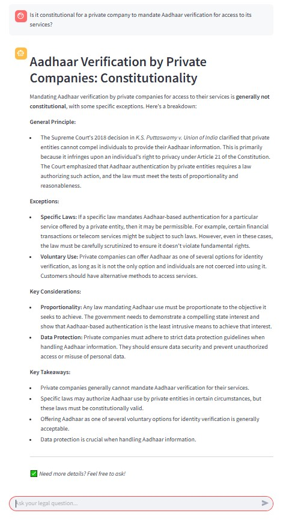
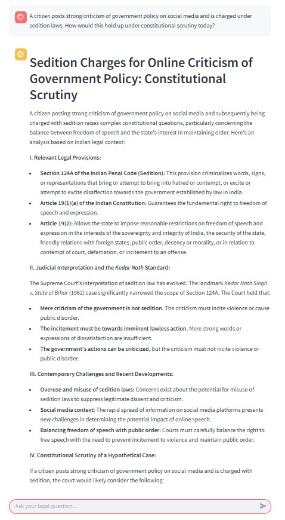

# SamvidhaanAI: A Legal Companion Chatbot using Retrieval-Augmented Generation (RAG) and Gemini AI

> **Kishore A G** – 23BAI1577 - kishoreag22@gmail.com

## 🧠 Abstract
**SamvidhaanAI** is a legal chatbot designed to improve accessibility to the Indian Constitution using a Retrieval-Augmented Generation (RAG) pipeline powered by **Google's Gemini AI**. It uses semantic embeddings, ChromaDB for retrieval, and LangChain for orchestration, all presented via an interactive **Streamlit** interface. This AI-driven system aims to bridge the gap between citizens and complex legal information.

---

## 📌 Introduction
The Indian Constitution, while comprehensive, is challenging to interpret due to its:
- Dense legal language
- Massive structure with hundreds of articles and amendments

**SamvidhaanAI** solves this by offering a smart, conversational legal assistant built on modern AI, making constitutional knowledge interactive and easy to access.

---

## ❗ Problem Statement
Despite its importance, the Constitution faces limited usage due to:
- ⚖️ Complex legal jargon
- 📚 Enormous volume
- 🧩 Lack of intelligent, accessible tools for laypersons

---

## ✅ Our Solution
**SamvidhaanAI** offers:
- 🔍 **RAG Pipeline**: Combines retrieval + generation for grounded legal responses
- 🧠 **Semantic Embeddings**: Captures meaning beyond keywords
- 🧾 **Contextual Memory**: Maintains multi-turn conversations
- 💬 **Interactive Frontend**: Streamlit-powered user interface

---

## ⚙️ Technical Architecture

### 🧩 Retrieval-Augmented Generation (RAG)
- **Retriever**: Fetches top relevant document chunks
- **Generator**: Gemini AI creates coherent, fact-grounded responses

### 🧠 Embeddings
- Using embedding-001 from Google Generative AI
- Converts text to vectors for semantic matching

### 🗃️ Vector Store: ChromaDB
- ✅ Real-time similarity search
- 💾 Embedding persistence
- 🔗 Seamless with LangChain
- 🏠 Works offline (local hosting)

### 📐 Similarity Search
- **Cosine Similarity** with Top-k = 10
- Measures angle between vectors to find semantically closest chunks

### 🤖 Language Model: Gemini 1.5 Pro
- 🔍 Long-context understanding
- 🧾 Structured and formal outputs
- 🗣️ Supports future multilingual use
- 🚫 Reduced hallucination risk

---

## 🛠️ Implementation Steps
```text
1. Parse the Constitution PDF → split into 2000-character chunks (with overlap)
2. Generate embeddings for each chunk → store in ChromaDB
3. On user query → retrieve top 10 similar chunks
4. Feed context + query into Gemini → generate response
5. Display output in Streamlit → maintain session memory
```

### 🧰 Tools & Technologies
| Component      | Tool/Technology                 |
|----------------|-------------------------------|
| Backend        | Python                        |
| AI Framework   | LangChain                     |
| Embeddings     | Google GenAI (embedding-001)  |
| Vector Store   | ChromaDB                      |
| PDF Parsing    | PyPDFLoader                   |
| LLM            | Gemini 1.5 Pro                |
| Interface      | Streamlit                     |
| Memory         | Session-based conversations   |

---

## 📷 Output Examples


### 🖼️ Output 1


### 🖼️ Output 2


### 🖼️ Output 3



---

## 🧾 Conclusion
**SamvidhaanAI** showcases the potential of RAG-based chatbots to democratize access to complex legal documents like the Indian Constitution. By grounding answers in contextually relevant content and maintaining user conversation flow, the tool becomes both educational and empowering.

---

## 🚀 Future Enhancements
- 📚 **Expand knowledge base**: Add more legal texts & landmark judgments
- 🌐 **Multilingual support**: Hindi, Tamil, Telugu, etc.
- ☁️ **Cloud Deployment**: For wider public use
- 📈 **Feedback Loop**: Improve with real user feedback

---

> 🏛️ *SamvidhaanAI is more than a technical project—it's a mission to build digital democracy through accessible legal intelligence.*
